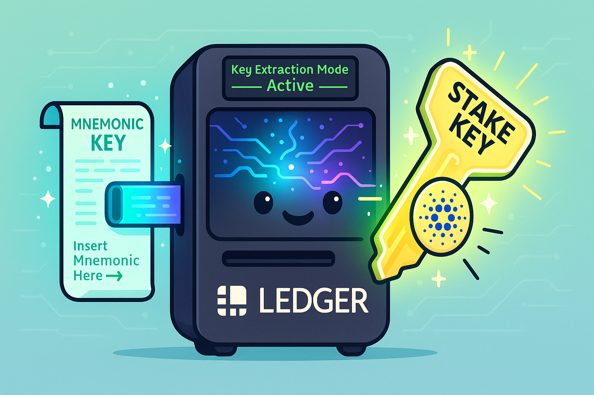

# Cardano Ledger Key Extraction Tool

<div align="center">
  
</div>

**⚠️ SECURITY WARNING: This tool handles cryptographic seed phrases and private keys. Only use on an air-gapped, offline machine. Never input real mnemonics on internet-connected devices or public services.**

## Overview

This toolkit enables Cardano stake pool operators to extract Shelley-era staking keys from a Ledger hardware wallet by deriving the Ledger master key from a BIP39 recovery phrase (12/18/24 words). It produces cardano-cli compatible key files for stake pool registration and rewards management.

**Purpose**: Generate payment and staking keypairs that match Ledger-derived addresses, allowing pool operators to manage rewards/pledge from wallets that support hardware wallet integration.

## Quick Links

📚 **Documentation:**

- 🚀 [Quick Start Guide](docs/QUICKSTART.md) - Get started in 5 minutes
- 🐳 [Docker Guide](docs/DOCKER.md) - Run in isolated container (recommended)
- 🛡️ [Security Guide](docs/SECURITY.md) - Detailed security best practices
- ❓ [FAQ](docs/FAQ.md) - Common issues and solutions
- 📖 [Glossary](docs/GLOSSARY.md) - Understand Cardano key management terms
- 🧪 [Testing Guide](docs/TESTING.md) - Test before using with real keys
- 💡 [Examples](docs/EXAMPLES.md) - Step-by-step usage examples
- 🔧 [Requirements](docs/REQUIREMENTS.md) - Detailed installation instructions
- 🤝 [Contributing Guide](docs/CONTRIBUTING.md) - How to contribute
- 📝 [Changelog](docs/CHANGELOG.md) - Version history and updates

## What This Tool Does

1. **JavaScript Key Generation** (`index.js`):

   - Derives Ledger-compatible master keys from BIP39 mnemonic entropy
   - Implements ed25519-bip32 key derivation (PBKDF2 + HMAC-SHA512)
   - Supports interactive input, stdin, and test modes
   - Validates mnemonic checksums and word counts

2. **Bash Conversion Script** (`convert.sh`):
   - Accepts master key and derives extended keys (xprv/xpub) for HD paths
   - Supports multiple networks (mainnet, testnet, preprod, preview)
   - Configurable account and address indices
   - Generates cardano-cli JSON key files with CBOR encoding
   - Builds and validates addresses (payment, stake, base)
   - Creates audit log with generation metadata
   - Verifies output matches Ledger's first Shelley address

## Prerequisites

### Required Tools

Install these binaries and ensure they're in your `PATH`:

| Tool                | Purpose                           | Installation                                                                             |
| ------------------- | --------------------------------- | ---------------------------------------------------------------------------------------- |
| **cardano-address** | Key derivation & address building | [cardano-wallet releases](https://github.com/cardano-foundation/cardano-wallet/releases) |
| **cardano-cli**     | Key conversion & verification     | [cardano-node releases](https://github.com/IntersectMBO/cardano-node/releases)           |
| **bech32**          | Encoding/decoding bech32 format   | [bech32 tool](https://github.com/IntersectMBO/bech32)                                    |
| **Node.js**         | Running JavaScript key generation | [nodejs.org](https://nodejs.org/)                                                        |

### Verify Installation

```bash
which cardano-address cardano-cli bech32 node
```

All commands should return valid paths.

## Installation

### Option 1: Docker (Recommended for Security)

🐳 **NEW**: Run in a completely isolated Docker container with no network access!

```bash
git clone <this-repo>
cd cardano-ledger-key-extractor

# Build and run in one step
./docker-run.sh full
```

The Docker container provides:

- ✅ Complete isolation from host system
- ✅ No network access (enforced by Docker)
- ✅ All dependencies pre-installed (cardano-cli, cardano-address, bech32)
- ✅ Non-root user execution
- ✅ Read-only filesystem

**See [Docker Guide](docs/DOCKER.md) for complete documentation.**

### Option 2: Quick Installation with Verification Script

The easiest way to get started (native installation):

```bash
git clone <this-repo>
cd cardano-ledger-key-extractor
npm install
./verify-installation.sh
```

The verification script will:

- ✅ Check all required dependencies
- ✅ Detect your OS and architecture (macOS, Linux, Windows/WSL2)
- ✅ Offer to automatically download and install missing Cardano tools
- ✅ Run functionality tests
- ✅ Provide security recommendations

**Supported Platforms**:

- macOS (Intel x86_64 & Apple Silicon arm64)
- Linux (x86_64 & aarch64)
- Windows (via WSL2)

If any Cardano tools are missing, the script will prompt:

```bash
Would you like to automatically download and install the missing tools?
This will download the latest official releases from GitHub.

Install missing Cardano tools? [y/N]
```

Answer `y` to automatically install `cardano-cli` and `cardano-address` from the latest official releases.

### Manual Installation

If you prefer manual installation, see [docs/REQUIREMENTS.md](docs/REQUIREMENTS.md) for detailed instructions.

## Usage

### Step 1: Generate Master Key (JavaScript)

**⚠️ Run this on an OFFLINE machine only!**

```bash
node index.js
```

The script includes a test mnemonic by default:

```bash
abandon abandon abandon abandon abandon abandon abandon abandon abandon abandon abandon about
```

**For production use**: Edit `index.js` and replace the test mnemonic with your actual recovery phrase.

**Expected output**:

```bash
Ledger Master Key: a08cf85b564ecf3b947d8d4321fb96d70ee7bb760877e371c664e21e59d0d45c4c995120a933e71e1c4567e849c85f2e8e9c3b62f89f8869b3e2e47f62fc9b2a2c5b5f5f8f9f9f9f9f9f9f9f9f9f9f9f9f9f9f9f9f9f9f9f9f9f9f9f9f
```

### Step 2: Derive Keys and Addresses (Bash)

```bash
./convert.sh output_directory "YOUR_MASTER_KEY_HEX"
```

**Example**:

```bash
./convert.sh my_keys "a08cf85b564ecf3b947d8d4321fb96d70ee7bb760877..."
```

**Output Files** (in `output_directory/`):

- `root.prv` - Root extended private key
- `stake.xprv` / `stake.xpub` - Stake keys (extended)
- `payment.xprv` / `payment.xpub` - Payment keys (extended)
- `stake.skey` / `stake.vkey` - Cardano-cli stake keys
- `payment.skey` / `payment.vkey` - Cardano-cli payment keys
- `stake.addr` - Stake address
- `payment.addr` - Payment-only address
- `base.addr` - Base address (payment + stake delegation)
- `base.addr_candidate` - Candidate for verification

### Step 3: Verify Output

The script automatically compares `base.addr` with `base.addr_candidate`. They must match!

**Also verify** that `base.addr` matches the first address (`/0`) shown in:

- AdaLite (Ledger integration)
- Yoroi (Ledger mode)
- Daedalus (hardware wallet view)

## Configuration Options

### Network Selection

Use the `CARDANO_NETWORK` environment variable:

```bash
# Mainnet (default)
CARDANO_NETWORK=mainnet ./convert.sh output/

# Testnet networks
CARDANO_NETWORK=testnet ./convert.sh output/
CARDANO_NETWORK=preprod ./convert.sh output/
CARDANO_NETWORK=preview ./convert.sh output/
```

### Custom Derivation Paths

Use `ACCOUNT` and `ADDRESS_INDEX` environment variables:

```bash
# Different account (default: 0)
ACCOUNT=1 ./convert.sh output/

# Different address index (default: 0)
ADDRESS_INDEX=5 ./convert.sh output/

# Combine multiple options
CARDANO_NETWORK=preprod ACCOUNT=2 ADDRESS_INDEX=10 ./convert.sh output/
```

Default derivation paths:

- Stake: `1852H/1815H/0H/2/0`
- Payment: `1852H/1815H/0H/0/0`

## Output Files

After running the conversion, you'll find these files in your output directory:

**Private Keys** (KEEP SECURE):

- `root.prv` - Root extended private key
- `stake.xprv` / `stake.skey` - Stake keys
- `payment.xprv` / `payment.skey` - Payment keys

**Public Keys**:

- `stake.xpub` / `stake.vkey` - Stake verification keys
- `payment.xpub` / `payment.vkey` - Payment verification keys

**Addresses**:

- `stake.addr` - Stake address
- `payment.addr` - Payment (enterprise) address
- `base.addr` - Base address (payment + stake delegation)

**Audit Trail**:

- `generation-log.txt` - Generation metadata and configuration (no secrets)

## Security Best Practices

### ✅ DO

- ✅ Run on air-gapped machines for production keys
- ✅ Verify output addresses match Ledger before using
- ✅ Store derived keys in encrypted storage
- ✅ Use hardware security modules (HSM) for pool operations
- ✅ Test with the canonical test mnemonic first
- ✅ Review audit logs after generation
- ✅ Securely wipe files after use

### ❌ DON'T

- ❌ Never use on internet-connected machines with real mnemonics
- ❌ Never paste mnemonics into web-based tools or REPLs
- ❌ Never commit private keys to version control
- ❌ Never share master keys or derived private keys
- ❌ Never reuse keys across different networks
- ❌ Don't trust this code blindly - review and audit it yourself

## Troubleshooting

### Common Issues

**Address doesn't match Ledger:**

- Verify you're using the correct network (mainnet vs testnet)
- Check account and address indices match (default: 0, 0)
- Ensure you used the correct mnemonic

**bech32 tool not found:**

- Install from [bech32 repo](https://github.com/IntersectMBO/bech32)
- Or use newer cardano-address (≥3.0.0) which doesn't require it

**Version compatibility issues:**

- The script auto-detects cardano-cli version
- Supports both extended (5880) and non-extended (5820) key formats
- See `generation-log.txt` for detected versions

**Permission denied:**

```bash
chmod +x index.js convert.sh
```

## Testing

Run the test suite:

```bash
npm test
```

Test with the canonical mnemonic:

```bash
node index.js --test
```

Expected base address for test mnemonic:

```bash
addr1qy2vzmtlgvjrhkq50rngh8d482zj3l20kyrc6kx4ffl3zfqayfawlf9hwv2fzuygt2km5v92kvf8e3s3mk7ynxw77cwqf7zhh2
```

See [Testing Guide](docs/TESTING.md) for comprehensive testing instructions.

## References

- **Cardano Specifications:**

  - [CIP-1852](https://cips.cardano.org/cips/cip1852/) - HD Wallets for Cardano
  - [BIP39](https://github.com/bitcoin/bips/blob/master/bip-0039.mediawiki) - Mnemonic code for generating deterministic keys

- **Tools & Documentation:**

  - [ed25519-bip32](https://IntersectMBO.github.io/adrestia/static/Ed25519_BIP.pdf) - Hierarchical Deterministic Keys over ed25519
  - [Adrestia Documentation](https://IntersectMBO.github.io/adrestia/)
  - [cardano-node](https://github.com/IntersectMBO/cardano-node) - Cardano CLI
  - [cardano-addresses](https://github.com/IntersectMBO/cardano-addresses) - Address derivation

- **Original Work:**
  - [ilap's gist](https://gist.github.com/ilap/5af151351dcf30a2954685b6edc0039b) - Original implementation

## License

MIT License - See LICENSE file for details

## Disclaimer

**NO WARRANTY EXPRESSED OR IMPLIED. USE AT YOUR OWN RISK.**

This tool handles cryptographic material that controls access to cryptocurrency funds. The authors and contributors accept no responsibility for lost funds, compromised keys, or any other damages resulting from use of this software.

Always:

- Test with small amounts first
- Verify all operations
